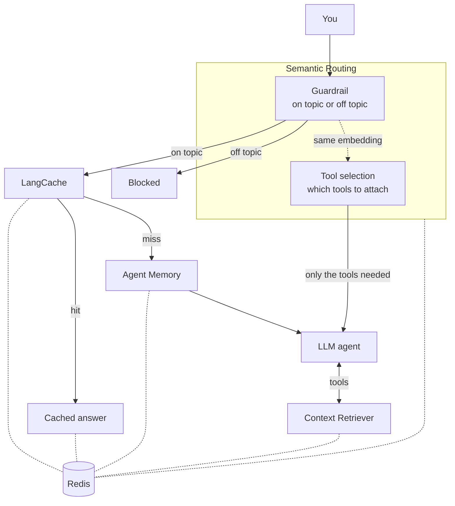

# Welcome to the Redis Iris Workshop

In this workshop you will run and explore a working AI agent built on **Redis Iris**, Redis's unified context engine for AI agents.

## What You'll Learn

- How **Semantic Routing** blocks off-topic questions before they reach the LLM
- How **LangCache** answers repeated questions from a semantic cache
- How **Agent Memory** carries short-term and long-term context between turns
- How **Context Retriever** gives the agent schema-first access to business data in Redis
- How **Semantic Routing** can also choose which tools the agent sees, cutting token use by half or more
- How a demo "domain" is defined, and how to change one

## How It Works

The demo is a food-delivery support agent (**Reddash**). The agent runs a pipeline for every message, and every stage reads from or writes to Redis (dotted lines): routes for Semantic Routing (the guardrail and tool selection), cached responses for LangCache, short- and long-term memory for Agent Memory, and your business data for Context Retriever:

## Your Workbench

| Panel | What it is |
|-------|-----------|
| **Code** | VS Code with the demo in `iris/` |
| **App** | The chat UI, with the Redis Iris activity panel |
| **Terminal** | A shell in `/code/iris` for `make` commands and tests |
| **Redis Insight** | Browse the data the demo loads into Redis (open it from the ☰ menu and add your database first, see [Task 2](/tasks/task-2.md)) |

Backend changes reload automatically; frontend changes hot-reload in the App panel.

## Getting Started

Head to the [Setup Guide](setup/setup.md), then start with [Task 1](tasks/task-1.md).
